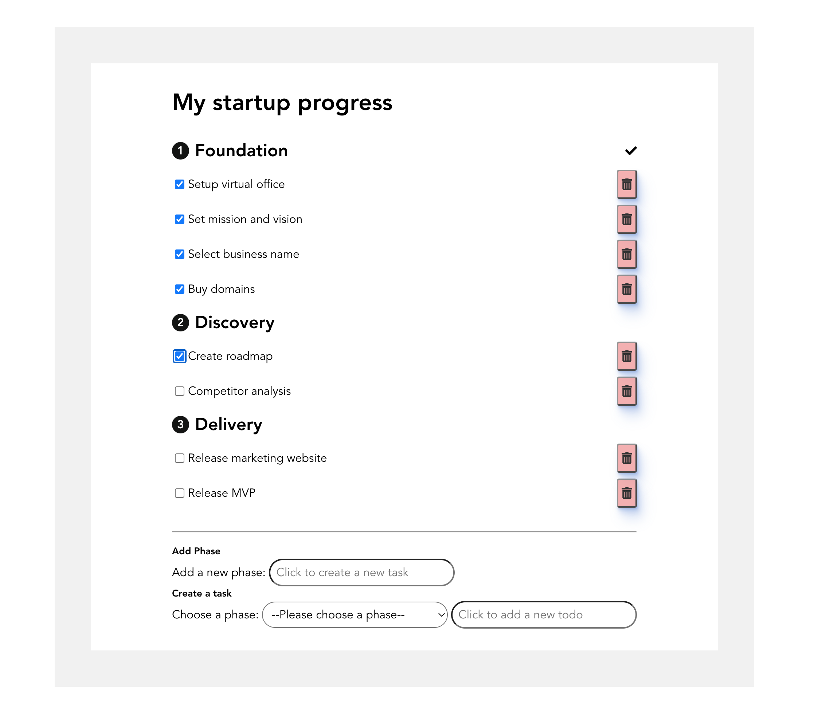

# Crave Start Up - Frontend

## CORE PRINCIPLES

-   We value quality over quantity, be sure your code works.
-   The code has to be yours and written from scratch. Does not need to be huge, but needs
    to be yours.
-   Implement the complexity based on your engineering level.
-   You can leave TODOs and comments in the code. We know the time is limited.
-   Be sure to provide all the info needed on how to run the code.

## THE ASSIGNMENT

-   Every startup goes through several stages.
-   In every stage, there are necessary steps to be accomplished.
-   Create a simple application that documents this progress.

View Live App [here](https://monumental-eclair-849ea2.netlify.app)

## REQUIREMENTS

-   Every phase can have an unlimited amount of tasks.
-   If the startup accomplishes all tasks in the phase, it’s marked as done and unlocks the
    next phase.
-   Tasks cannot be marked as completed unless all tasks in the previous phase were
    completed.

### REQUIREMENTS - Frontend:

-   Implement in React
-   Store the progress in local storage
-   When all phases are completed, display a random fact from [uselessfacts](https://uselessfacts.jsph.pl/random.json)

# How to run project

### Clone the repo [here](https://github.com/yuhcee/crave-startup)

`Open your terminal`

Run `git clone https://github.com/yuhcee/crave-startup`

### Install packages

Run `yarn`

### Run the project

Run `yarn start`

Navigate to your [browser](http://localhost:3000/) to view project live in your browser.

## Notes

_Happy coding!_ Thanks!
